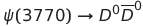
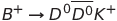
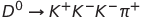

Psi-Decays
==========

This code represents the work of my summer internship in 2013.
The purpose of this code is two-part:

1. Investigate the invariant mass distributions of the product particles of three decays:

  * 
  * 
  * 

2. Investigate the decay angles between product pairs in the following two decays:

  * 
  * 

These results demonstrate that the decay angle of the decays is sufficiently
sharply peaked to be used as a discriminator from the background.

It can therefore be used to distinguish the 
decays for use in symmetry violation studies such as those measuring the strong
phase information of the decay.
